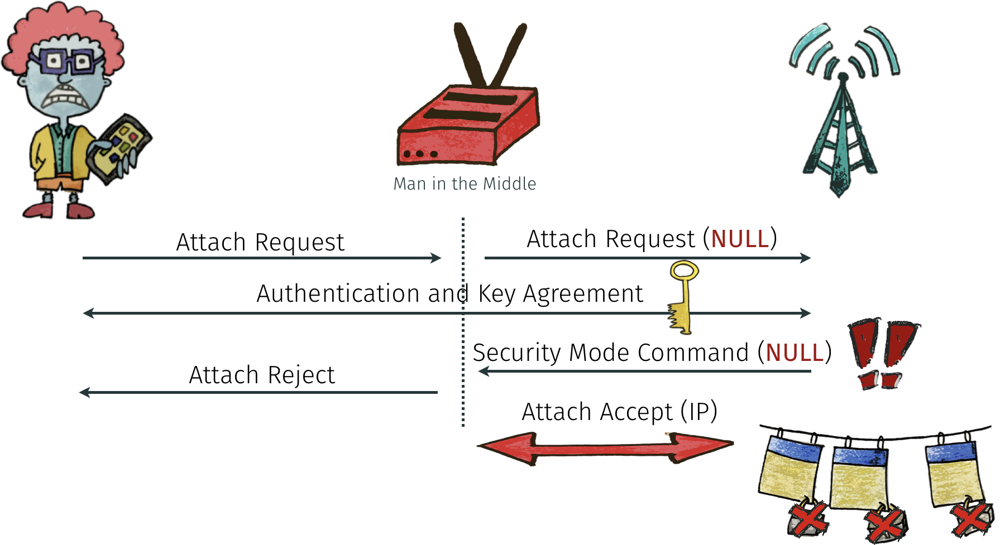

This tool quickly tests LTE networks for their cipher support. It's for use by telecom operators only.

## LTE Security Disabled—Misconfiguration in Commercial Networks.

Check out our research paper and talk at WiSec 2019 ([Paper](./img/wisec19-final123.pdf), [Talk](./img/WiSec19-LTE_Security_Disabled.pdf)):
> Merlin Chlosta, David Rupprecht, Thorsten Holz, and Christina Pöpper. 2019. LTE Security Disabled—Misconfiguration in Commercial Networks. In 12th ACM Conference on Security and Privacy in Wireless and Mobile Networks (WiSec ’19), May 15–17, 2019, Miami, FL, USA. ACM, New York, NY, USA, 6 pages. https://doi.org/10.1145/3317549.3324927

Contact me at [merlin.chlosta+eia0@rub.de](mailto:merlin.chlosta+eia0@rub.de) for inquiries.

# Encryption in LTE Networks

LTE networks protect user traffic and control data with encryption, and additionally integrity-protect control data. We're going to have a look at the method that is used for securing the data.


There are multiple ciphers available, thus, smartphone and network need to negotiate which one to use. Snow3G, AES and ZUC actually protect the messages. However, there's a 'NULL' algorithm for testing purposes and emergency calls -- it does not provide any protection.


Networks and smartphones must support AES and Snow3G. ZUC is optional. The NULL algorithm may only be selected for emergency purposes.

## Impact of Misconfigurations

If a network is poorly configured, man-in-the-middle attacks become trivial. If a network accepts unprotected connections, attackers can impersonate benign users. That means, the attacker get's an IP address, while the unaware user pays for the data.



Due to roaming, your users might be affected even if your network is properly configured; attackers can authenticate to vulnerable roaming partner networks.

# Setup

The whole setup looks like this:


We typically use Ettus USRP B210 as Software Defined Radio, and the smartcard readers that are built into the Dell standard keyboards.

First, build the docker image:
```console
host:~$ git clone https://github.com/mrlnc/LTE-ciphercheck.git
host:~$ cd LTE-ciphercheck
host:LTE-ciphercheck$ docker build -t LTE-ciphercheck .
```

Run tests with the `start_test.sh` script, that feeds the required parameters to the docker image.

```
host:LTE-ciphercheck$ ./start-test.sh --dl-earfcn 123 --apn internet --imei <IMEI of your smartphone>
```

This executes a minimal test set with only a few vulnerable cases. 

## Advanced Configuration

Basically, this software is just [srsLTE](https://github.com/srsLTE/srsLTE) with minor changes. See the [srsLTE README](https://github.com/srsLTE/srsLTE/blob/master/README.md) for detailed build instructions, and [www.srslte.com](srslte.com) for documentation and guides.

# Results

After running, the results are stored in a temporary directory:
```
host:LTE-ciphercheck$ ./start-test.sh --dl-earfcn 123 --apn internet --imei <IMEI of your smartphone>
...
Found Cell:  Mode=FDD, PCI=313, PRB=100, Ports=2, CFO=3.4 KHz
Found PLMN:  Id=26201, TAC=65349
...
---  exiting  ---
Started 2020-03-30_11:38, finished 2020-03-30_11:40
Results written to /tmp/tmp.R7TrLy872Q on host.
```

```
host $ ls /tmp/tmp.R7TrLy872Q
config  log  pcap
```

The main result log file is `log/results.log`.

## Accepted Cipher

```
09:38:44.748108 [Main  ] [I] New Testcase 1 with EIA 11111111 EEA 11111111
09:38:45.750189 [Main  ] [I] Testcase 1 got NAS Security Mode Command. Integrity: 128-EIA2, Ciphering: 128-EEA2
09:38:45.906163 [Main  ] [I] Testcase 1 got RRC Security Mode Command. Integrity: 128-EIA2, Ciphering: 128-EEA2
09:38:45.906188 [Main  ] [I] RRC encryption key - k_rrc_enc
             0000: 6c 33 eb 8d f0 0e 1e cf ee 5d ef c4 23 fd 8a 97
             0010: 09 4a de 99 78 30 24 39 e0 fd b8 47 d8 ac d0 9e
09:38:45.906205 [Main  ] [I] RRC integrity key - k_rrc_int
             0000: 7b 53 0b 3c 27 ff 61 05 82 60 c7 70 aa 32 bf 0e
             0010: 47 32 47 f2 a0 4d 3a 45 e8 c9 65 b8 bd 76 07 23
09:38:45.906213 [Main  ] [I] UP encryption key - k_up_enc
             0000: 3e 3e 4c 4e bb d3 23 bc 52 de 3a 9d a8 a9 44 c1
             0010: 67 64 84 29 3c f7 7e 75 dc 3b 80 2a 6e 39 42 da
09:38:45.910286 [Main  ] [I] Testcase 1 got Attach Accept
```

The ciphers here are set to `11111111` -- just everything enabled. This is a connectivity check. The script always performs a connectivty check before running the test case, to make sure everything still works.

We can see here:
* `NAS Security Mode Command`: the MME accepts the selected ciphers
* `RRC Security Mode Command`: the eNodeB accepts them, too
* Security Keys (for reading the RRC PCAPs)
* `Attach Accept`: the Attach procedure has finished, we were assigned an IP address

## Rejected Cipher

```
10:14:58.912488 [Main  ] [I] New Testcase 44 with EIA 00001001 EEA 00000001
10:14:59.390112 [Main  ] [I] Testcase 44 got Attach Reject, cause: MME_EMM_CAUSE_PROTOCOL_ERROR_UNSPECIFIED
```

In this test case, the cipher selection for integrity protection is 00001001, that is, EIA-ZUC (0b1000) and EIA-NULL (0b0001) only. For encryption, only NULL (0b0001) is allowed.

The network should not accept such configuration. In this example, the network is properly configured and rejects the connection.

# Testing Procedure

When the UE starts the connection procedure, it will transmit a list of supported ciphers. The network then selects one of these, based on it's own capabilities. If there's no match, or some policy prohibits some cipher (e.g., NULL), the network must reject the connection attempt.

For example, if the UE signals only NULL ciphers for encryption and integrity protection, the network should not establish a connection as in this example:


We perform one connection setup for each possible combination of ciphers and check whether the network accepts or denies. Since there are 256 combinations, a single test run performs at least that many attaches to the network.

# Credits

srsLTE is a free and open-source LTE software suite developed by SRS (www.softwareradiosystems.com). See [www.srslte.com](srslte.com) for documentation, guides and project news. srsLTE is released under the AGPLv3 license and uses software from the [OpenLTE project](http://sourceforge.net/projects/openlte) for some security functions and for NAS message parsing.

[Katharina Kohls](https://kkohls.org) allowed me to use the pictograms, taken from her research papers or presentations. Thanks!
