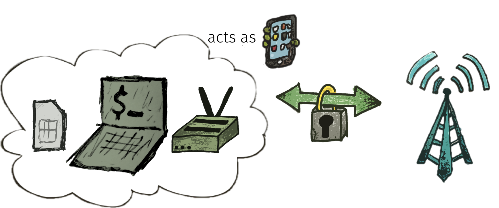

This tool quickly tests LTE networks for their cipher support. It's for use by telecom operators only. It was presented at WiSec 2019 ([Paper](./img/wisec19-final123.pdf), [Talk](./imgWiSec19-LTE_Security_Disabled.pdf)):

> Merlin Chlosta, David Rupprecht, Thorsten Holz, and Christina Pöpper. 2019. LTE Security Disabled—Misconfiguration in Commercial Networks. In 12th ACM Conference on Security and Privacy in Wireless and Mobile Networks (WiSec ’19), May 15–17, 2019, Miami, FL, USA. ACM, New York, NY, USA, 6 pages. https://doi.org/10.1145/3317549.3324927

This branch is a work in progress (rebasing on more recent srsLTE release). If you got questions or suggestions, drop me an email: [merlin.chlosta+eia0@rub.de](merlin.chlosta+eia0@rub.de)

# Encryption in LTE Networks

LTE networks protect user traffic and control data with encryption, and additionally integrity-protect control data. We're going to have a look at the method that is used for securing the data.

There are multiple ciphers available, thus, smartphone and network need to negotiate which one to use. Snow3G, AES and ZUC actually protect the messages. However, there's a 'NULL' algorithm for testing purposes and emergency calls -- it does not provide any protection.

Networks and smartphones must support AES and Snow3G. ZUC is optional. The NULL algorithm may only be selected for emergency purposes.

## Impact of Misconfigurations

If a network is poorly configured, man-in-the-middle attacks become trivial. If a network accepts unprotected connections, attackers can impersonate benign users.

# Setup

The whole setup looks like this:

Basically, this software is just [srsLTE](https://github.com/srsLTE/srsLTE) with minor changes. See the [srsLTE README](https://github.com/srsLTE/srsLTE/blob/master/README.md) for detailed build instructions, and [www.srslte.com](srslte.com) for documentation, guides and project news. srsLTE is released under the AGPLv3 license and uses software from the OpenLTE project (http://sourceforge.net/projects/openlte) for some security functions and for NAS message parsing.

# Testing Procedure

When the UE starts the connection procedure, it will transmit a list of supported ciphers. The network then selects one of these, based on it's own capabilities. If there's no match, or some policy prohibits some cipher (e.g., NULL), the network must reject the connection attempt.

For example, if the UE signals only NULL ciphers for encryption and integrity protection, the network should not establish a connection as in this example:

We perform one connection setup for each possible combination of ciphers and check whether the network accepts or denies. Since there are 256 combinations, a single test run performs at least that many attaches to the network.

# Credits

srsLTE is a free and open-source LTE software suite developed by SRS (www.softwareradiosystems.com).

[Katharina Kohls](kkohls.org) allowed me to use the pictograms, taken from her research papers or presentations. Thanks!
